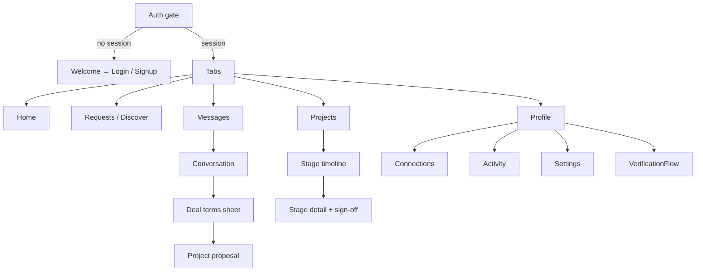

# Influnet Mobile App — Analysis & Detailed Build Plan

**Date:** 2026-07-20 · **Status:** Phases 0–5 built on `feat/mobile-app` — see [MOBILE_BUILD_STAGES.md](../operations/MOBILE_BUILD_STAGES.md)
**Companion docs:** [MOBILE_ARCHITECTURE_STRATEGY.md](MOBILE_ARCHITECTURE_STRATEGY.md) (the strategy this expands on) · [MOBILE_BUILD_STAGES.md](../operations/MOBILE_BUILD_STAGES.md) (what actually got built + what's left)

> **Where the build deviated from this plan.** Three decisions changed during
> implementation, each recorded in [apps/mobile/README.md](../../apps/mobile/README.md):
> **NativeWind → StyleSheet** (role accents re-tint at runtime, which is where
> utility classes fight you, and it drops a Metro/Babel transform that has to
> track every RN release); **stream-chat-expo → the existing `messages` table +
> Supabase Realtime** (the API already owns that table, so a row-insert
> subscription is the whole feature); and **victory-native deferred** (nothing
> in the first pass needed a chart). Everything else below was built as written.

This is a full analysis of the existing codebase and a screen-by-screen plan for building the Influnet mobile app with **React Native + Expo**. The guiding principle throughout: **the mobile app is a redesign, not a port**. No screen is a shrunken web page — every surface is rethought around thumb reach, one-column layouts, native navigation, and push-driven re-engagement.

---

## 1. Executive summary

| Question | Answer |
|---|---|
| Framework | **React Native via Expo** (expo-router, EAS Build/Submit/Update) |
| Backend | **Reuse the existing `/api/*` surface as-is** — zero new backend for v1 (see §2.1) |
| Database | Same Supabase project; mobile is just a second client |
| Code sharing | Extract ~6 pure-TS modules into `packages/` (~2,500 LOC shared, all business logic) |
| UI | **Written fresh** — new mobile design system reusing the web's design *tokens*, not its components |
| Chat | `stream-chat-expo` (official RN SDK for the Stream account you already have) |
| Payments | Razorpay RN SDK, kept env-gated exactly like the web |
| v1 scope | Creator + Business roles only. **Admin console, media-kit editor, and public profiles stay web-only** |
| New backend work | Only one thing: push-notification device tokens + a send hook (§7.5) |
| Timeline | ~12–14 weeks to store submission across 6 phases (§9) |

The single most important finding: **`apps/web/src/lib/api.ts` already authenticates API requests via `Authorization: Bearer <supabase access token>`** (line 29), and the web's own client (`api-client.ts`) already calls the API this way rather than relying on cookies. This means the entire API surface — 46 routes covering auth, discovery, collabs, conversations/deals, projects, payments, verification, notifications, activity, uploads — **works from a mobile app today with no changes**. The mobile app is therefore almost purely a frontend project.

---

## 2. Current-state analysis

### 2.1 What exists (and what mobile can reuse)

```
influnet/
├── apps/
│   ├── web/       Next.js 16 + React 19 — the entire product
│   └── landing/   Static landing page
├── packages/      ← does not exist yet
└── supabase/      Migrations, edge functions
```

| Layer | Today | Mobile reuse |
|---|---|---|
| Auth | Supabase Auth (email+password, OTP scaffolding), `@supabase/ssr` cookies on web | ✅ `supabase-js` works natively in RN; swap cookie storage for SecureStore |
| API | 46 Next.js route handlers under `/api/*`, bearer-token auth, zod-validated, rate-limited, Sentry-instrumented | ✅ **100% reusable** — mobile calls the deployed web app's API |
| DB | Supabase Postgres, RLS + PII column lockdown | ✅ untouched; mobile never talks to the DB directly except via supabase-js auth/realtime |
| Chat | Stream Chat (`stream-chat-react`), token endpoint at `/api/stream/token` | ✅ same account + token endpoint; UI via `stream-chat-expo` |
| Storage | Cloudinary signed uploads via `/api/uploads/sign` | ✅ same flow with `expo-image-picker` |
| Payments | Razorpay, env-gated (`payment-gate.tsx`), webhook at `/api/payments/webhook` | ✅ Razorpay has an official RN SDK; webhook unchanged |
| IG verification | HikerAPI/Apify scrape + ownership code flow | ✅ pure API flows, reusable |
| Observability | Sentry + rate limiting on the API | ✅ add `sentry-expo` for the client side |

### 2.2 Business logic that should be extracted and shared

These files in `apps/web/src/lib/` are **pure TypeScript with no DOM/Next dependency** — they are the exact "write once, use on both platforms" layer the strategy doc calls for:

| File | What it is | Target package |
|---|---|---|
| `project-lifecycle.ts` | The 12 `STAGES`, `ALLOWED_TRANSITIONS`, `STAGE_ACTOR` | `@influnet/core` |
| `project-stage-guide.ts` | Per-stage instructions, sign-off/skip rules | `@influnet/core` |
| `project-status.ts` | Centralized status → label/color mapping | `@influnet/core` |
| `constants.ts` | Niches, languages, collab types, price tiers, states, industries | `@influnet/core` |
| `validators.ts` | Zod schemas | `@influnet/core` |
| `api-client.ts` | `apiFetch` wrapper (needs a base-URL param + token-getter injection) | `@influnet/api` |
| `src/types/*` | Database + API types | `@influnet/types` |
| CSS custom properties in `globals.css` | Brand/surface/content/status tokens | `@influnet/tokens` (as a TS object) |

### 2.3 What can NOT be ported (and what replaces it)

| Web dependency | Used for | Mobile replacement |
|---|---|---|
| `@dnd-kit/*` | Kanban drag-and-drop board | **Don't port.** Redesign as a vertical stage timeline (§6.5) — drag-Kanban is a desktop pattern |
| `@xyflow/react` | Project flow diagram | Skip in v1; the stage timeline conveys the same info |
| `recharts` | Dashboard charts | `victory-native` (or `react-native-gifted-charts`) |
| `framer-motion` | Animations | `react-native-reanimated` (+ `moti` for a similar declarative API) |
| Tailwind CSS 4 | Styling | **NativeWind v4** — same class syntax, supports CSS-variable theming, so the token system carries over |
| `@base-ui/react` / shadcn | UI primitives | Custom RN primitives mirroring `components/ui/*` (§5) |
| `sonner` | Toasts | `burnt` (native toasts) or `sonner-native` |
| `lucide-react` | Icons | `lucide-react-native` — same icon names, zero relearning |
| `cobe`, `canvas-confetti` | Landing globe, confetti | Landing stays web; confetti via `react-native-confetti-cannon` if wanted |
| `stream-chat-react` | Chat UI | `stream-chat-expo` |
| `zustand`, `zod`, `date-fns` | State, validation, dates | ✅ work unchanged in RN |

---

## 3. Target architecture

```
influnet/
├── apps/
│   ├── web/                     (unchanged behavior; imports from packages/)
│   ├── landing/
│   └── mobile/                  ← NEW: Expo app
│       ├── app/                 expo-router file-based routes (mirrors Next mental model)
│       ├── components/          mobile-only UI (never shared with web)
│       ├── features/            screen logic grouped by domain
│       └── lib/                 supabase client (SecureStore), push, deep links
├── packages/
│   ├── types/                   DB + API types (from apps/web/src/types)
│   ├── core/                    lifecycle, stage guide, status, constants, validators
│   ├── api/                     platform-agnostic apiFetch + typed endpoint helpers
│   └── tokens/                  design tokens as TS (colors, spacing, radii, type scale)
└── supabase/                    (unchanged)
```

Key decisions:

1. **Mobile talks to the deployed web app's API, not to Supabase directly** (except for auth session + Stream/realtime). This keeps RLS, PII lockdown, rate limiting, admin gating, and audit logging in one place. The API base URL comes from the existing `APP_ENV` system: dev → dev deployment, staging → staging, prod → prod.
2. **`packages/api`** exposes `createApi({ baseUrl, getToken })` — web passes its Supabase browser client's token getter, mobile passes one backed by SecureStore. Same typed endpoint functions on both.
3. **Auth on mobile:** `supabase-js` with `expo-secure-store` as the storage adapter, `autoRefreshToken: true`, `detectSessionInUrl: false`. Password reset and email confirmation use deep links (`influnet://auth/callback`) registered in Supabase's redirect allowlist.
4. **Session-token refresh** already matches how the web works — `apiFetch` pulls the live session token per request, so nothing new to invent.

### 3.1 Phase-0 refactor (web changes, mobile prerequisite)

Extract the §2.2 files into `packages/`, update `apps/web` imports, and verify the web build + tests still pass. This is 1–2 weeks, purely mechanical, and is the only change the web app needs. Turborepo already has `packages/*` in the workspace globs, so no root config changes beyond adding the packages.

---

## 4. Mobile design language

The web dashboard's token system (`globals.css`) is genuinely good and carries over as the brand foundation:

- **Brand:** pink `#ee3e96` → coral `#f26e59` gradient, `#d6358a` pressed states
- **Surfaces:** `#f6f7f9` app background, white cards, hairline borders `#eef0f4`
- **Content:** slate ink scale (`#0f172a` / `#475569` / `#94a3b8`)
- **Status:** ok/warn/info/danger + soft variants (already centralized for project statuses)

What changes for mobile:

| Web pattern | Mobile pattern |
|---|---|
| 14px-dense information tables | 17px list rows, one data point per line, chevron affordance |
| Hover states | Pressed states (opacity/scale via Reanimated), haptics on key actions |
| Sidebar + header chrome | Bottom tab bar + large-title headers, chrome hides on scroll |
| Modals & dropdown menus | **Bottom sheets** (`@gorhom/bottom-sheet`) — the single most-used mobile container in this app |
| Multi-column stat grids | 2-up stat cards, horizontally snapping carousels for more |
| Command palette (⌘K) | Search screen + pull-to-search on lists |
| Toast top-right | Native toast bottom / snackbar above tab bar |
| Light mode only (dashboard) | Ship light-only v1 to match web; token structure keeps dark mode cheap later |

**Typography:** keep the dashboard's font pairing if it has mobile licenses; otherwise SF Pro / Roboto system stack with the same scale ratios. **Spacing:** 4-pt grid, 16px screen gutters, 12px radius on cards (matches `--radius: 0.625rem` ≈ 10px, rounded up for touch aesthetics).

---

## 5. Mobile component library

Built fresh in `apps/mobile/components/`, styled with NativeWind against `@influnet/tokens`. The web `components/ui/*` inventory maps almost 1:1 in *role* (not in code):

| Web primitive | Mobile primitive | Notes |
|---|---|---|
| `button.tsx` | `Button` | 48px min height, full-width default, haptic on press, loading spinner state |
| `card.tsx` / `section-card.tsx` | `Card`, `SectionCard` | Same hairline+shadow recipe |
| `stat-card.tsx` | `StatCard` | 2-up grid unit with delta arrow |
| `badge.tsx` / `verified-badge.tsx` | `Badge`, `VerifiedBadge` | Status colors from `@influnet/core` project-status map |
| `avatar.tsx` | `Avatar` | `expo-image` with blurhash placeholder |
| `input.tsx` | `Input`, `TextArea`, `OTPInput` | Floating label, error state, keyboard-type aware |
| `tabs.tsx` | `SegmentedControl` | For in-screen switches (e.g. Incoming/Sent requests) |
| `table.tsx` | `ListRow` | **Tables become tappable list rows** — never render a table on mobile |
| `page-header.tsx` | Navigation header | Native large-title via expo-router screen options |
| `empty-state.tsx` | `EmptyState` | Same illustrations/copy |
| `skeleton.tsx` | `Skeleton` | Reanimated shimmer |
| `chart.tsx` | `MiniChart` | victory-native sparkline/donut |
| — (new) | `Sheet` | Bottom-sheet wrapper — filters, deal terms, stage actions, confirmations |
| — (new) | `Chip` | Filter chips (niche, tier, state) |
| — (new) | `StageTimeline` | The mobile replacement for the Kanban board (§6.5) |
| — (new) | `SignoffBar` | Sticky bilateral sign-off footer on stage screens |
| — (new) | `NotificationBell`, `UnreadDot` | Tab-bar and header badges |

---

## 6. Information architecture & screen-by-screen redesign

### 6.1 Navigation model

**Bottom tab bar, 5 tabs, role-resolved at login** (same pattern as the web's role-based sidebar, rethought for thumbs):

```
Creator:   [ Home ] [ Requests ] [ Messages ] [ Projects ] [ Profile ]
Business:  [ Home ] [ Discover ] [ Messages ] [ Projects ] [ Profile ]
```

- **Messages center-adjacent** because chat is where deals happen (negotiate → propose project happens in-conversation per the 2026-07-20 deal-flow model).
- Business gets **Discover** as a tab (it's their primary job-to-be-done); creators get **Requests** (inbound demand is theirs).
- **Connections, My activity, Settings, Verification** live under the **Profile** tab as pushed screens — they're maintenance surfaces, not daily drivers.
- **Admin: web-only for v1.** The admin console is dense, tabular, low-frequency, desk-work. If an admin logs into the app, show a polite "Admin tools live on the web" screen with their creator/business view if they have one.
- Notifications: bell in the Home header opening a notification screen (backed by `/api/notifications`), plus badges on tabs (`unread`, `pending` — same counts the web sidebar uses).



### 6.2 Auth & onboarding

| Web page | Mobile screen(s) | Redesign notes |
|---|---|---|
| `/` (landing) | **Welcome screen** | 2–3 swipeable value-prop slides + "I'm a creator / I'm a business" fork. No cobe globe, no marketing site — the store listing is the landing page |
| `/login` | **Login** | Email+password, biometric unlock (`expo-local-authentication`) after first login, "forgot password" → deep-linked reset |
| `/signup`, `/signup/influencer`, `/signup/business` | **Signup wizard** | The long web forms become **one-question-per-screen steps** with a progress bar: role → email/password (live username check via `/api/auth/check-username`, reusing the same debounce logic) → profile basics → niche/industry chips → location → IG handle (creator, triggers the scrape) → done. Each step is a full screen with a sticky CTA — mobile users abandon long forms, not short steps |
| `/reset-password` | Handled via deep link into a **New password** screen | |
| Admin approval gate | **"Under review" state screen** | Pending users land on a status screen with push notification on approval — better than the web equivalent because push closes the loop |

### 6.3 Home (per role)

Web: `dashboard/home` with welcome card, stats, action items. Mobile becomes a **feed, not a dashboard**:

- **Header:** greeting + avatar + notification bell.
- **Action queue first** — cards for things needing a decision *now*: pending request, stage awaiting your sign-off, unread deal message, verification nudge. Each card deep-links straight to the action. This is the #1 reason the app will out-engage the web.
- **Stats second:** 2-up StatCards (creator: profile views, active projects, pending requests, earnings-to-date; business: active campaigns, responses, spend), tap-through to detail.
- Welcome/checklist card for new users (mirrors the web's persisted welcome card).
- Pull-to-refresh everywhere; data from `/api/home`, `/api/influencer/dashboard`, `/api/business/dashboard` unchanged.

### 6.4 Discover, Requests & Connections

| Web | Mobile redesign |
|---|---|
| `dashboard/discover` (filter panel + results grid) | **Card feed** — full-width creator cards (photo, name+verified badge, niche chips, follower count, price tier), infinite scroll. Filters move to a **bottom sheet** opened by a filter button showing active-filter count; quick filter chips (niche, tier) ride in a horizontal rail under the search bar. Tapping a card pushes **Creator detail** — a native rendering of the public-profile data (audience donuts as victory-native, collab types, reviews) with a sticky **"Send request"** CTA |
| `dashboard/requests/new` | **Request composer** — a focused single screen (collab type chips, budget, message), launched from Creator detail |
| `dashboard/requests` (tables) | **Requests screen** — SegmentedControl `Incoming / Sent`, status-badged ListRows, swipe actions where safe (accept opens a confirm sheet — accept ≠ project in the new deal flow, so the sheet explains "this opens a conversation"). Detail pushes a full screen with the request context + Accept / Decline / Open chat |
| `dashboard/connections` | **Connections list** under Profile tab — avatar rows → mini profile sheet → "Message" / "View profile" |

### 6.5 Projects — the biggest redesign

Web today: Kanban board (dnd-kit) + guided stage flow. **Mobile drops the Kanban entirely.** Drag-and-drop across 12 columns is hostile on a phone, and the guided flow's bilateral sign-off model is *already* the right mobile abstraction:

- **Projects tab:** ListRows grouped `Active / Awaiting you / Completed`, each showing counterpart avatar, title, current stage pill (colors from the shared status map), and a "your move" indicator when your sign-off is pending.
- **Project detail: a vertical `StageTimeline`** of all 12 stages (`collaboration_started` → `project_completed`) — done stages collapsed with checkmarks + timestamps, **current stage expanded inline** with the per-stage guidance from `@influnet/core`'s stage guide (purpose + "what you do" / "what they do"), future stages dimmed. Skippable stages show the skip-proposal affordance; `NON_SKIPPABLE_STAGES` (payments, revision loop, terminal) don't.
- **Stage detail screen** for the current stage: instructions, stage items/deliverables (from `/api/projects/[id]/stage-items`), attachments, change requests, and a sticky **SignoffBar** — "You've confirmed ✓ / Waiting for {name}" with both parties' state. Sign-off fires a push to the counterpart (§7.5). This is where mobile *beats* the web: sign-offs become a 10-second phone interaction instead of a "next time I'm at my desk" task.
- **Payment stages** (`advance_payment`, `final_payment`): business sees a pay CTA opening the Razorpay RN checkout; creator sees a payment-status card. Env-gated identically to the web's `payment-gate.tsx`.
- **Proposal flow:** project proposals (bilateral, migration 069 model) render as a **proposal card in the conversation** + a Proposals section on the Projects tab; accepting shows terms in a sheet with an explicit confirm.
- Reviews on completion: star + text sheet on the `project_completed` stage (`/api/projects/[id]/reviews`).

### 6.6 Messages & deal flow

- `stream-chat-expo` themed with Influnet tokens: channel list (avatar, preview, unread, project/deal context line) → channel screen.
- **Deal panel → "Deal" bar + sheet:** the web's side-panel becomes a compact deal-status bar pinned above the composer ("Negotiating · ₹15,000 · 2 deliverables"), tapping opens the full **deal terms bottom sheet** (view/edit terms, propose project). Deal actions post system messages in-channel like the web.
- Report/block from the conversation overflow menu (`/api/reports`, `/api/blocks`).
- Push notifications for messages via Stream's push integration (it handles APNs/FCM natively once device tokens are registered).

### 6.7 Profile tab & everything under it

| Surface | Mobile treatment |
|---|---|
| Public profile preview | **Profile home:** header card rendered as the public `/c/[username]` data + completeness meter + "Share profile" (native share sheet with the profile URL — the *web* public page stays the shareable artifact) |
| Profile editing | Sectioned edit screens (basics, niches, rates, audience) — small focused forms, not one mega-form |
| Media kit | **View + share only in v1** (it's a web-rendered artifact); editing stays on web |
| IG verification | Native flow: enter handle → scrape via existing API → ownership code screen with copy button + "Open Instagram" app link → poll for badge. Push on badge grant |
| My activity | Timeline list from the `get_user_activity` RPC-backed `/api/activity` |
| Settings | Account, notification preferences (new: per-category push toggles), blocked users, sign out, delete account (App Store requirement — needs a support path if none exists) |

### 6.8 Explicitly out of scope for mobile v1

Landing site, public profiles `/c/`, `/b/`, `/vf/[code]`, media-kit *editing*, the admin console, the Kanban board view, the xyflow project-flow diagram, and `ui-preview`. All continue to live on web; the app share-sheets link to them where relevant.

---

## 7. Platform integrations (net-new work)

1. **Deep links / universal links:** `influnet://` scheme + associated domains so shared profile/project URLs open the app when installed. Needed for auth callbacks regardless.
2. **Image/video pickers:** `expo-image-picker` → existing Cloudinary signed-upload flow.
3. **Biometrics:** optional FaceID/fingerprint re-lock.
4. **Haptics:** `expo-haptics` on sign-offs, accepts, payments.
5. **Push notifications — the only new backend surface.** The `notifications` table and `/api/notifications` already exist; add:
   - Migration: `device_push_tokens (user_id, expo_push_token, platform, last_seen_at)`.
   - `POST /api/notifications/devices` to register/refresh tokens.
   - A send hook where `notify.ts` writes notifications → Supabase Edge Function (or a call inside `notify.ts`) that fans out via Expo Push API.
   - Stream handles chat pushes itself once configured with APNs/FCM credentials.

---

## 8. Testing & delivery

- **Shared packages:** the existing Vitest suites move with the extracted code — lifecycle transitions, validators, matchmaking already have tests.
- **Mobile unit/UI:** Jest + React Native Testing Library for primitives and screen logic; the API layer is mocked at the `@influnet/api` boundary.
- **E2E:** Maestro flows mirroring `E2E_SYSTEM_FLOW_TEST.md` (signup → discover → request → chat/deal → proposal → stages → completion).
- **Builds:** EAS Build with three profiles wired to the existing `APP_ENV` tiers (dev/staging/prod API base URLs); EAS Update (OTA) for JS-only fixes on staging/prod; internal distribution via TestFlight + Play internal testing.
- **CI:** add `mobile` to Turborepo tasks (`lint`, `typecheck`, `test`); EAS builds triggered from the existing GitHub Actions setup on `staging`/`prod` branches.

---

## 9. Phased roadmap

| Phase | Scope | Duration | Exit criteria |
|---|---|---|---|
| **0. Extraction** | Create `packages/{types,core,api,tokens}`; move §2.2 modules; web imports updated | 1–2 wk | Web builds, tests green, zero behavior change |
| **1. Foundation** | Expo scaffold in `apps/mobile`, expo-router, NativeWind + tokens, Supabase auth (SecureStore, deep links), component library core (Button/Card/Input/ListRow/Sheet/Badge/Skeleton) | 2 wk | Login → session persists → authenticated `/api/home` call renders |
| **2. Core loops (read + request)** | Signup wizard, Home feeds, Discover + creator detail, Requests (incoming/sent + accept/decline), Connections, Activity, notifications screen | 3 wk | Business can find a creator and send a request; creator can accept — E2E on device |
| **3. Chat & deals** | stream-chat-expo, deal bar/sheet, project proposals, chat push via Stream | 2 wk | Full negotiate → propose → accept loop on two phones |
| **4. Projects & money** | StageTimeline, stage detail + bilateral sign-off, stage items/uploads, change requests, Razorpay stages (env-gated), reviews, app push (device tokens + fan-out) | 3 wk | A 12-stage project driven end-to-end from two phones, pushes firing |
| **5. Ship** | Verification flow, settings, empty/error/offline states, haptics polish, Maestro suite, Sentry, store assets, TestFlight/Play review cycle | 2 wk | Approved in both stores |

**Total: ~13 weeks.** Phases 2–4 each end in a demoable on-device milestone. Web development continues in parallel — after Phase 0 the two apps only share `packages/`, so neither blocks the other.

---

## 10. Risks & open decisions

| Risk / decision | Notes | Recommendation |
|---|---|---|
| **Apple/Google IAP rules vs Razorpay** | Campaign payments are for real-world services between businesses and creators, which both stores exempt from in-app-purchase requirements (physical/real-world services). Still the #1 store-review risk if a reviewer misreads it | Keep payments env-gated (already built); be ready to ship v1 with payment stages as "recorded on web" if review stalls; document the service nature in review notes |
| **Stream Chat pricing** | Mobile push + more MAU on the existing plan | Verify plan limits before Phase 3 |
| **Expo SDK / RN New Architecture churn** | Pin an SDK at Phase 1, upgrade only between phases | |
| **Token drift between web CSS and mobile tokens** | Two sources of truth | `@influnet/tokens` becomes canonical; web `globals.css` values generated or lint-checked against it (can be a later cleanup) |
| **Delete-account requirement (Apple)** | Store rejection if missing | Confirm an account-deletion path exists before Phase 5 |
| **Admin on mobile** | Deliberately excluded | Revisit only if admins ask; likely never worth it |
| **Offline behavior** | v1 = graceful offline states + pull-to-refresh, not offline-first | React Query/SWR-style caching in `@influnet/api` consumers is enough |

---

## 11. Immediate next steps

1. Sign off on this plan (especially: bottom-tab IA in §6.1, Kanban→timeline in §6.5, admin web-only, v1 scope cut in §6.8).
2. Phase 0: extract `packages/{types,core,api,tokens}` — this benefits the web codebase even if mobile slips.
3. Decide the Expo SDK + minimum OS targets (recommend: current stable SDK, iOS 15+, Android 8+ — covers the Indian market distribution well).
4. Create Apple Developer + Google Play accounts now (Apple verification can take days–weeks; both needed before Phase 5, Apple needed for device push testing in Phase 4).
